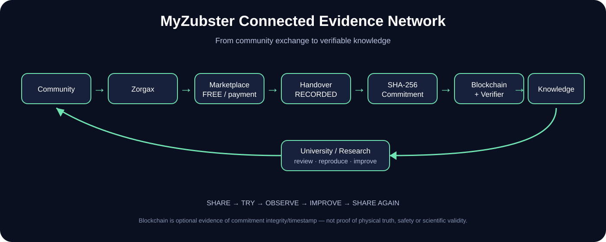

# MyZubster — Connected Evidence Network

<p align="center"></p>

## From Marketplace to verifiable knowledge

```text
PERSON / COMMUNITY
      ↓
ZORGAX
      ↓
MARKETPLACE
      ↓
FREE EXCHANGE or VERIFIED PAYMENT
      ↓
HANDOVER → RECEIVED → RECORDED
      ↓
SHA-256 COMMITMENT
      ↓
OPTIONAL BLOCKCHAIN ANCHOR
      ↓
INDEPENDENT VERIFIER
      ↓
KNOWLEDGE
      ↓
RESEARCH / REPRODUCTION
      ↓
SHARE → TRY → OBSERVE → IMPROVE → SHARE AGAIN
```

The canonical machine-readable map is [`ecosystem.json`](ecosystem.json). The detailed public walkthrough is [`docs/MYZUBSTER-PUBLIC-JOURNEY.md`](docs/MYZUBSTER-PUBLIC-JOURNEY.md).

## KF-006 / Nicola — real public evidence example

The Nicola kefir pilot is a concrete **FREE** Marketplace exchange: no payment is asserted. The handover state is `RECORDED`; blockchain evidence is represented separately by `onchainRecorded=true`.

- schema: `myzubster.marketplace-handover.v1`
- network: Base Sepolia
- chain ID: `84532`
- block: `46933575`
- commitment: `ba9973f08ce86d16a3611c3cccbb9cc2cc779b9ea1cb6fd87a2e5864e557b6b9`
- transaction: https://sepolia.basescan.org/tx/0x998a98b1733312e248f74a1387319dae30aab8123a6115c517e4ffe0ef9584bf
- independent verifier result: `MATCH`

The verifier is part of the MyZubster core repository. The commitment demonstrates integrity/timestamp of the committed record. It does **not** prove physical truth, food safety, participant identity, learning, health effects or scientific validity.

## Connected public nodes

[MyZubster Core](https://github.com/MyZubster-Ecosystem/myzubster) · [Marketplace](https://github.com/DanielIoni-creator/MyZubster-Marketplace) · [Kefir / Knowledge Protocol](https://github.com/DanielIoni-creator/Myzubster-fermentation-kefir) · [Nicola](https://github.com/DanielIoni-creator/Nicola) · [University & Research](https://github.com/DanielIoni-creator/myzubster-university-research) · [Research Lab](https://github.com/DanielIoni-creator/Myzubster-research-lab) · [Agriculture](https://github.com/DanielIoni-creator/Myzubster-agriculture) · [Student Profile](https://github.com/DanielIoni-creator/Myzubster-student-profile) · [Developer Support](https://github.com/DanielIoni-creator/Myzubster-developer-support) · [LIFE Pilot](https://github.com/DanielIoni-creator/Myzubster-life-pilot) · [Community Network](https://github.com/DanielIoni-creator/Myzubster-community-dao) · [Visual / Comic Universe](https://github.com/MyZubster-Ecosystem/MyZubster-Visual)

## Payment boundary

`MYZ` is an internal MyZubster utility/accounting credit. A verified Stripe payment, MYZ accounting entry, external cryptocurrency settlement and blockchain evidence are distinct states. The KF-006/Nicola kefir example is FREE and therefore bypasses payment.

## Research boundary

A repository link, discussion, contact with a researcher, pilot document or blockchain record does not establish a university partnership, institutional endorsement, funding or scientific validation. Research outputs should preserve the distinction between hypothesis, observation, reproduction/review and validated conclusion.

## Public knowledge principle

MyZubster's evidence loop is:

> **Share → Try → Observe → Improve → Share again**

Evidence can be classified as `PERSONAL_PRACTICE`, `TRADITIONAL_PRACTICE`, `OBSERVATION`, `EXTERNAL_SOURCE` or `VERIFIED_GUIDANCE`. Evidence must not be silently promoted to `VERIFIED_GUIDANCE`.
